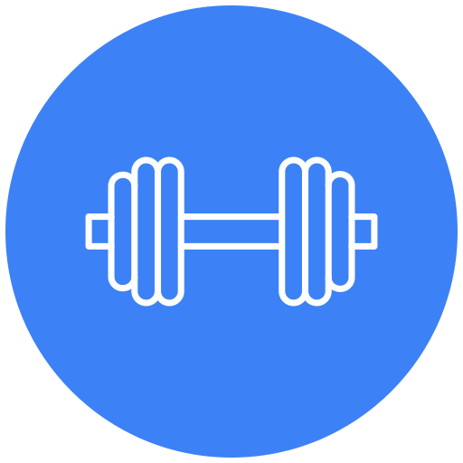
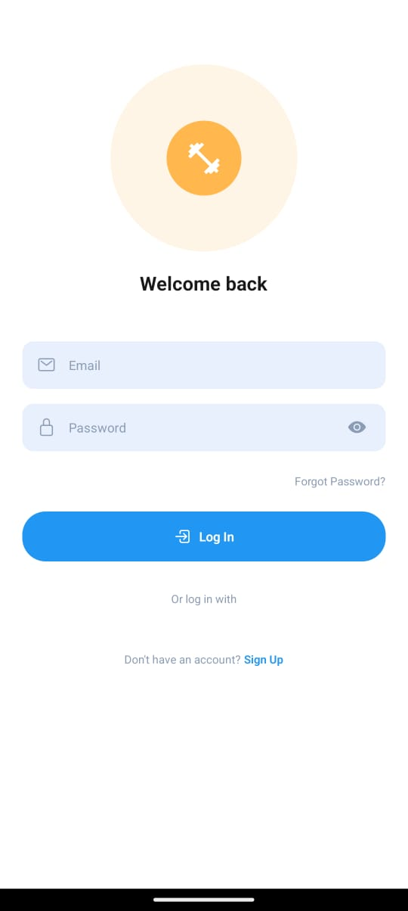
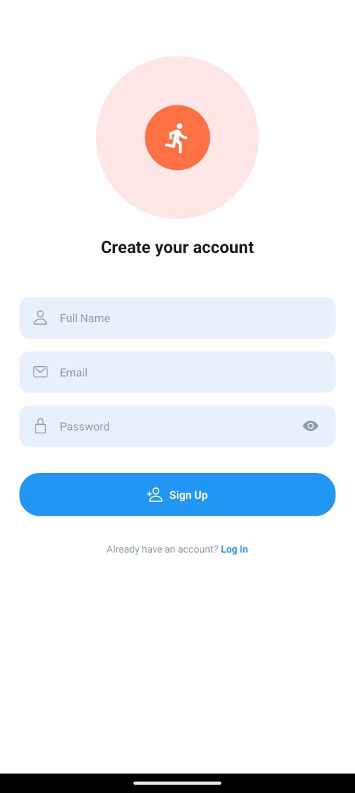
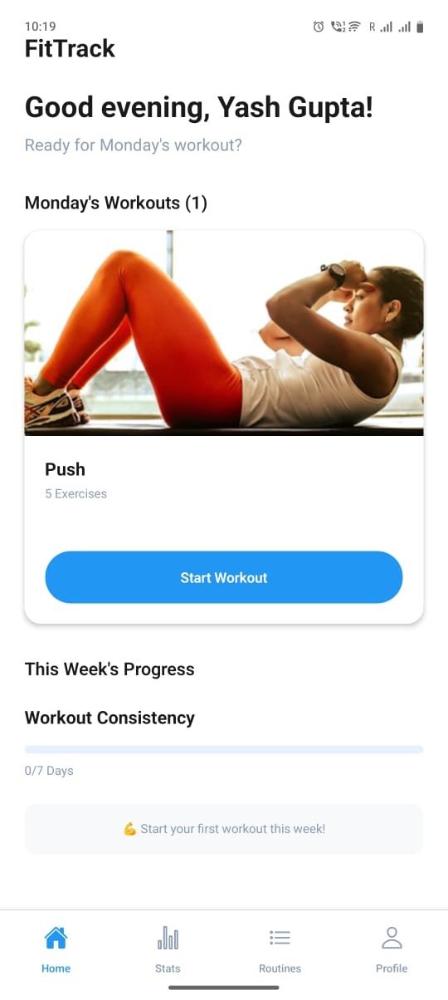
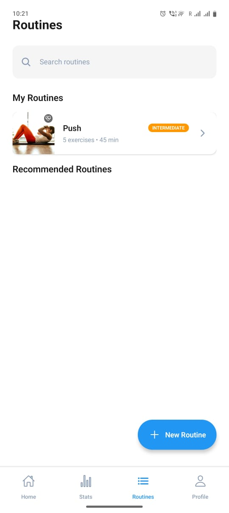
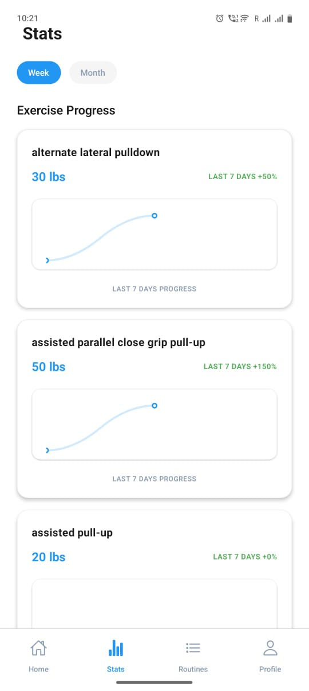
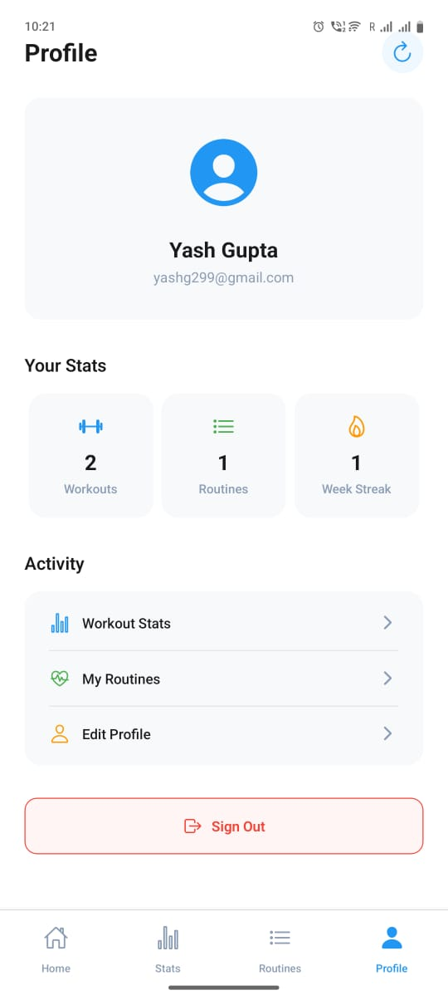
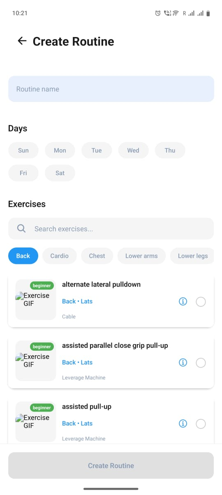

<div align="center">
  
  
  # 🏋️‍♂️ FitTrack
  
  **Your Ultimate Fitness Companion**
  
  *A modern, feature-rich fitness tracking application built with React Native*
  
  [](https://reactnative.dev/)
  [](https://firebase.google.com/)
  [](https://www.typescriptlang.org/)
  [](https://expo.dev/)

  ---

  ## 📱 Try FitTrack Now!
  
  ### Download the APK
  
  <table>
  <tr>
  <td align="center">
    
    <br />
    <strong>📲 Scan to Download APK</strong>
    <br />
    <a href="https://expo.dev/accounts/ibtesam121/projects/fittrack/builds/c0d5bd2c-a392-42b4-9caa-124c1181d344 ">Direct Download Link</a>
  </td>
  </tr>
  </table>
</div>

---

## ✨ Features at a Glance

<table>
<tr>
<td width="50%">

### 🔐 **Smart Authentication**
- Secure Firebase Auth integration
- Email/password registration & login
- Persistent session management
- User profile customization

### 🏃‍♂️ **Workout Management** 
- Create custom workout routines
- Browse recommended workouts
- Exercise library with GIF demonstrations
- Real-time workout tracking

</td>
<td width="50%">

### 📊 **Progress Analytics**
- Detailed workout statistics
- Weekly consistency tracking  
- Exercise progression charts
- Personal achievement streaks

### 🎨 **Modern Experience**
- Beautiful, intuitive UI design
- Smooth animations & transitions
- Responsive layout for all devices
- Dark/light theme support

</td>
</tr>
</table>

---

## 🖼️ App Screenshots

*Experience the clean, modern design of FitTrack*

### 🔐 Authentication Screens
<table>
<tr>
<td align="center">
  
  <br />
  <strong>Welcome Back - Login</strong>
  <br />
  <em>Clean login interface with email/password fields</em>
</td>
<td align="center">
  
  <br />
  <strong>Create Account - Signup</strong>
  <br />
  <em>User registration with full name, email, and password</em>
</td>
</tr>
</table>

### 📱 Main App Features
<table>
<tr>
<td align="center">
  
  <br />
  <strong>🏠 Home Dashboard</strong>
  <br />
  <em>Daily workout recommendations and progress overview</em>
</td>
<td align="center">
  
  <br />
  <strong>🏃‍♂️ Workout Routines</strong>
  <br />
  <em>Browse and manage your workout routines</em>
</td>
<td align="center">
  
  <br />
  <strong>📊 Progress Analytics</strong>
  <br />
  <em>Track your fitness progress and statistics</em>
</td>
</tr>
<tr>
<td align="center">
  
  <br />
  <strong>👤 User Profile</strong>
  <br />
  <em>Manage account settings and view achievements</em>
</td>
<td align="center">
  
  <br />
  <strong>✏️ Routine Builder</strong>
  <br />
  <em>Create custom workout routines with exercises</em>
</td>
</tr>
</table>

---

## 🚀 How to Use FitTrack

### Getting Started
1. **📲 Download & Install** - Get the APK from the QR code above
2. **👤 Create Account** - Sign up with your email and password  
3. **🏠 Explore Dashboard** - View your daily workout recommendations
4. **💪 Start Working Out** - Choose a routine and begin your fitness journey!

### Key Workflows

<details>
<summary><strong>🏋️‍♂️ Starting a Workout</strong></summary>

1. Navigate to **Routines** tab
2. Browse available workouts or search by muscle group
3. Tap on a routine to see exercise details
4. Hit **Start Workout** to begin
5. Follow along with exercise GIFs and track your sets
6. Complete the workout to save your progress

</details>

<details>
<summary><strong>✏️ Creating Custom Routines</strong></summary>

1. Go to **Routines** and tap **Create New**
2. Name your routine and select target days
3. Choose exercises from the comprehensive library
4. Set reps, weights, and rest periods
5. Save your custom routine for future use

</details>

<details>
<summary><strong>📈 Tracking Progress</strong></summary>

1. Visit the **Stats** tab after workouts
2. View your weekly consistency streak
3. Analyze exercise progression over time
4. Monitor monthly workout summaries
5. Set new fitness goals based on your data

</details>

---

## 🛠️ Tech Stack & Architecture

<div align="center">

| **Frontend** | **Backend** | **Development** | **Deployment** |
|:------------:|:-----------:|:---------------:|:--------------:|
| React Native | Firebase Auth | TypeScript | Expo EAS |
| Expo SDK 53 | Firestore DB | ESLint | React Navigation |
| Zustand | Cloud Functions | Prettier | Vector Icons |

</div>

### 🏗️ Project Architecture

```
📦 FitTrack/
├── 📱 src/
│   ├── 🧩 components/         # Reusable UI components
│   │   ├── AuthHeader.tsx     # Authentication headers
│   │   ├── CustomButton.tsx   # Styled buttons
│   │   ├── CustomInput.tsx    # Form inputs
│   │   ├── ExerciseCard.tsx   # Exercise display cards
│   │   ├── ProgressBar.tsx    # Progress indicators
│   │   ├── RoutineCard.tsx    # Workout routine cards
│   │   └── WorkoutCard.tsx    # Daily workout cards
│   │
│   ├── 📱 screens/            # Application screens
│   │   ├── HomeScreen.tsx     # Dashboard with daily routines
│   │   ├── LoginScreen.tsx    # User authentication
│   │   ├── RoutinesScreen.tsx # Workout library
│   │   ├── CreateRoutineScreen.tsx # Routine builder
│   │   ├── StartWorkoutScreen.tsx  # Exercise tracking
│   │   ├── StatsScreen.tsx    # Progress analytics
│   │   └── ProfileScreen.tsx  # User management
│   │
│   ├── 🗄️ store/             # State management (Zustand)
│   │   ├── authStore.ts       # Authentication state
│   │   ├── routineStore.ts    # Workout routines
│   │   ├── workoutStore.ts    # Exercise tracking
│   │   └── exerciseStore.ts   # Exercise library
│   │
│   ├── 🔧 services/          # Business logic layer
│   │   ├── authService.ts     # Firebase auth operations
│   │   ├── routineService.ts  # Routine CRUD operations
│   │   ├── workoutService.ts  # Workout tracking logic
│   │   └── exerciseService.ts # Exercise data management
│   │
│   ├── 🧭 navigation/        # App navigation setup
│   │   ├── AppNavigator.tsx   # Main navigation container
│   │   └── TabNavigator.tsx   # Bottom tab navigation
│   │
│   ├── 📊 data/              # Static data and constants
│   │   └── exercises.ts       # Exercise database
│   │
│   └── 🎨 styles/            # Global styling
│       └── GlobalStyles.ts    # Shared style definitions
│
├── 📦 assets/                # App assets
│   ├── icon.png              # App icon
│   ├── splash.png            # Splash screen
│   └── adaptive-icon.png     # Android adaptive icon
│
└── ⚙️ config files           # Project configuration
    ├── package.json          # Dependencies
    ├── app.json             # Expo configuration
    ├── tsconfig.json        # TypeScript config
    └── eslint.config.mjs    # Code linting rules
```

---

## 🚀 Quick Start Guide

### Prerequisites
- Node.js 18+ 
- npm or yarn
- Expo CLI
- Firebase project

### Installation Steps

```bash
# 1️⃣ Clone the repository
git clone https://github.com/your-username/fittrack.git
cd FitTrack

# 2️⃣ Install dependencies
npm install

# 3️⃣ Set up environment variables
cp .env.example .env
# Edit .env with your Firebase credentials

# 4️⃣ Start the development server
npm start
```

### 🔥 Firebase Setup

1. Create a project at [Firebase Console](https://console.firebase.google.com/)
2. Enable **Authentication** with Email/Password
3. Set up **Firestore Database** 
4. Get your config from Project Settings
5. Update your `.env` file:

```env
FIREBASE_API_KEY=your_api_key_here
FIREBASE_AUTH_DOMAIN=your_project_id.firebaseapp.com
FIREBASE_PROJECT_ID=your_project_id
FIREBASE_STORAGE_BUCKET=your_project_id.appspot.com
FIREBASE_MESSAGING_SENDER_ID=your_sender_id_here
FIREBASE_APP_ID=your_app_id_here
```

### 📱 Run the App

```bash
# 🍎 iOS Simulator
npm run ios

# 🤖 Android Emulator  
npm run android

# 🌐 Web Browser
npm run web

# 📱 Physical Device (Expo Go)
npm start  # Then scan QR code
```

---

## 🎯 Core Features Deep Dive

### 🏠 **Home Dashboard**
The central hub of your fitness journey:
- **Daily Routine Cards**: Personalized workout recommendations
- **Progress Overview**: Quick glance at your weekly consistency
- **Quick Actions**: Fast access to start workouts or browse routines
- **Motivational Insights**: Streak counters and achievement badges

### 🏃‍♂️ **Workout Routines**
Comprehensive workout management:
- **Curated Library**: Professional routines for all fitness levels
- **Custom Builder**: Create personalized workouts with 1000+ exercises
- **Smart Search**: Find routines by muscle group, difficulty, or duration
- **Routine Management**: Edit, duplicate, and organize your workout plans

### 💪 **Exercise Tracking**
Real-time workout experience:
- **Interactive Interface**: Clean, distraction-free workout screen
- **Exercise Guidance**: Animated GIFs demonstrating proper form
- **Set Logging**: Track reps, weights, and rest periods
- **Progress Tracking**: See your strength gains over time
- **Workout Timer**: Built-in rest timers and workout duration tracking

### 📊 **Analytics & Stats**
Data-driven fitness insights:
- **Progress Charts**: Visual representation of your strength gains
- **Consistency Metrics**: Weekly and monthly workout frequency
- **Personal Records**: Track your best lifts and achievements
- **Trend Analysis**: Understand your fitness patterns and areas for improvement

### 👤 **Profile Management**
Personalized user experience:
- **Account Settings**: Manage your profile and preferences
- **Workout History**: Complete log of all your training sessions
- **Achievement System**: Unlock badges and celebrate milestones
- **Data Export**: Download your fitness data for external analysis

---

## 🎨 Design Philosophy

FitTrack embraces a **minimalist yet powerful** design approach:

- **🎯 User-Centric**: Every feature is designed with the user's workout flow in mind
- **📱 Mobile-First**: Optimized for one-handed use during workouts
- **⚡ Performance**: Fast loading times and smooth animations
- **🎨 Beautiful UI**: Modern design language with fitness-focused aesthetics
- **♿ Accessible**: Inclusive design for users of all abilities

---

## 🔒 Security & Privacy

Your data security is our priority:

- **🔐 Secure Authentication**: Firebase Auth with industry-standard encryption
- **🛡️ Data Protection**: All user data is encrypted in transit and at rest
- **🔒 Privacy First**: No tracking, no ads, no data selling
- **💾 Local Storage**: Sensitive data stored securely on your device
- **🔑 Permission Management**: Granular control over app permissions

---

## 🤝 Contributing

We welcome contributions from the fitness and developer community!

### How to Contribute

1. **🍴 Fork the Repository**
   ```bash
   git fork https://github.com/your-username/fittrack.git
   ```

2. **🌿 Create a Feature Branch**
   ```bash
   git checkout -b feature/amazing-feature
   ```

3. **💻 Make Your Changes**
   - Follow our coding standards
   - Add tests for new features
   - Update documentation as needed

4. **✅ Test Your Changes**
   ```bash
   npm test
   npm run lint
   ```

5. **📤 Submit a Pull Request**
   - Provide a clear description of changes
   - Include screenshots for UI changes
   - Link any related issues

### 🐛 Bug Reports

Found a bug? Help us improve FitTrack:

1. Check if the issue already exists
2. Use our bug report template
3. Provide steps to reproduce
4. Include device/OS information

### 💡 Feature Requests

Have ideas for new features?

1. Search existing feature requests
2. Use our feature request template
3. Describe the problem it solves
4. Provide implementation suggestions

---

## 📈 Roadmap

### 🚀 Upcoming Features

- [ ] **Social Features**: Connect with friends and share workouts
- [ ] **Nutrition Tracking**: Calorie and macro tracking integration
- [ ] **Wearable Integration**: Sync with fitness trackers and smartwatches
- [ ] **AI Workout Planner**: Personalized routine generation
- [ ] **Video Tutorials**: Professional exercise demonstration videos
- [ ] **Offline Mode**: Work out without internet connection
- [ ] **Multiple Languages**: Support for international users

### 🎯 Long-term Vision

- **🏆 Competition Mode**: Challenges and leaderboards
- **🧘 Wellness Integration**: Meditation and recovery features
- **📱 Widget Support**: Home screen widgets for quick access
- **🎨 Theme Customization**: Personalized app themes
- **📊 Advanced Analytics**: ML-powered insights and recommendations

---

## 📖 Documentation

### 📚 Developer Resources

- [**API Documentation**](./docs/api.md) - Complete API reference
- [**Component Library**](./docs/components.md) - Reusable UI components
- [**State Management**](./docs/state.md) - Zustand store patterns
- [**Testing Guide**](./docs/testing.md) - Testing strategies and examples
- [**Deployment**](./docs/deployment.md) - Build and deploy instructions

### 🎓 User Guides

- [**Getting Started**](./docs/user-guide.md) - New user onboarding
- [**Workout Creation**](./docs/workouts.md) - Building custom routines
- [**Progress Tracking**](./docs/progress.md) - Understanding your analytics
- [**Troubleshooting**](./docs/troubleshooting.md) - Common issues and solutions

---

## 🌟 Support the Project

Love FitTrack? Here's how you can support us:

- ⭐ **Star this repository** to show your support
- 🐛 **Report bugs** to help us improve
- 💡 **Suggest features** to make FitTrack even better
- 🤝 **Contribute code** to join our development community
- 📢 **Share FitTrack** with your fitness-minded friends

---

## 📄 License

This project is licensed under the **MIT License** - see the [LICENSE](LICENSE) file for details.

```
MIT License

Copyright (c) 2025 FitTrack Team

Permission is hereby granted, free of charge, to any person obtaining a copy
of this software and associated documentation files (the "Software"), to deal
in the Software without restriction, including without limitation the rights
to use, copy, modify, merge, publish, distribute, sublicense, and/or sell
copies of the Software, and to permit persons to whom the Software is
furnished to do so, subject to the following conditions:

The above copyright notice and this permission notice shall be included in all
copies or substantial portions of the Software.
```

---

## 📞 Contact & Support

<div align="center">

### 💬 Get Help

**Have questions? Need support? We're here to help!**

[](https://github.com/your-username/fittrack/issues)
[](https://discord.gg/fittrack)
[](mailto:support@fittrack.app)

### 🌐 Stay Connected

[](https://twitter.com/fittrack_app)
[](https://linkedin.com/company/fittrack)
[](https://fittrack.app)

</div>

---

<div align="center">
  
  ### 🏋️‍♂️ Ready to Start Your Fitness Journey?
  
  **Download FitTrack today and transform the way you work out!**
  
  <a href="DOWNLOAD_LINK_HERE">
    
  </a>
  
  ---
  
  *Made with ❤️ by the FitTrack Team*
  
  **Together, let's make fitness accessible for everyone! 💪**

</div>
